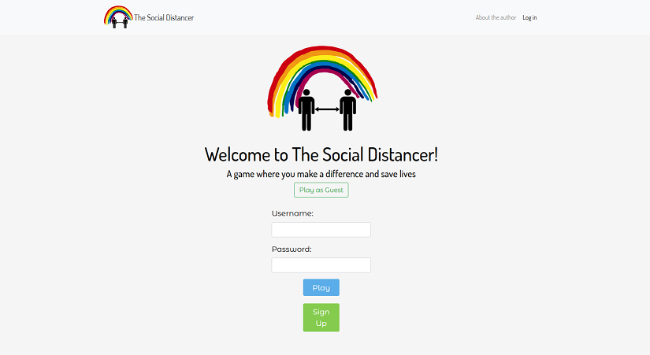
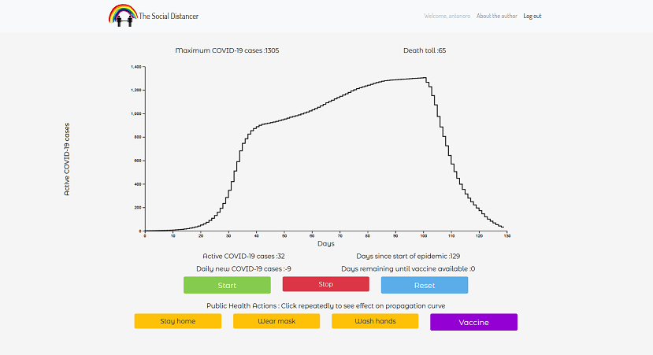

# The Social Distancer

A game where you make a difference and save lives. Third project of Web Development class ISIS3710 at Universidad de los Andes.

## 1: Objectives and technologies used

This project was designed as a simple clicking game that would help understand the effects of Public Health measures on epidemics. A growing epidemic propagation curve will be mitigated and reduced by a set of different actions that can be taken by the user. 

### Technologies used

This project is developed mainly using Javascript, HTML and CSS. Express.js was used to build the main framework and server-side, while a React.js app was built for the front-end user interface side. MongoDB (on Atlas cloud) provides a database management system, while bootstrap gives fonts and templates for front-end cosmetics. Heroku was used to deploy the app on the web.

## 2: Walk-through / How to deploy

### 2.1: Prerequisites

Deployed web version:

This app is deployed at this <a href="https://thesocialdistancer.herokuapp.com">link</a>.


Web dev version:

After cloning the project repository to a local folder, you'll need to install these few dependencies and softwares:

- Node.js : You'll absolutely need this Javascript runtime, since everything server-side is based upon it. I recommend using yarn to download all pacakages, as its compatibility is better than npm with React. Either use npm install or yarn install to add all needed Node packages to the project.

- MongoDB : Using yarn, adding mongodb to your project is fairly easy to develop your own DB. I suggest downloading MongoDB Compass, which provides an intuitive UI to manage database creations and content. You'll need a DB called 'TheSocialDistancerData' and a collection called 'users'. In there, I use documents with fields username, email and password. For now, passwords aren't hashed.

You will of course need a web browser, such as Firefox, to load the front-end part of our project. Finally, to use and modify the project for personal use, you'll need a text/code editor, such as Visual Studio Code or SublimeText.  

### 2.2: How to install

Install all dependencies provided in the package.json file: 

```
yarn install

```

### 2.3: How to launch

I added nodemon to relaunch the project after every change in dev mode (the deployed version needs standard node), using this command:

```
yarn start:dev
```

Navigate to localhost:3001 on your web browser and enjoy my app!

## 3: Author

This project is made by Antoine Noreau, for the Web Developement Class at Universidad de Los Andes, Colombia. 

Antoine Noreau // https://antonoro.github.io

Link to my github profile: https://github.com/antonoro

## 4: Screenshots of project

Log in page: 



Game panel:



## 5: Licence

This project is licensed under the terms of the MIT <a href="./LICENSE.md">License</a>.
